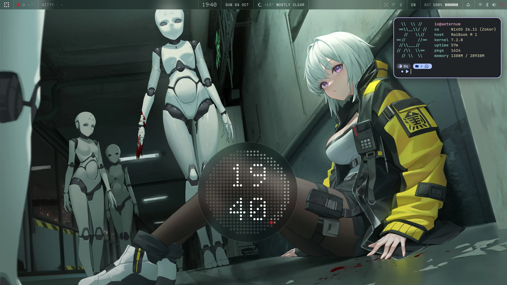
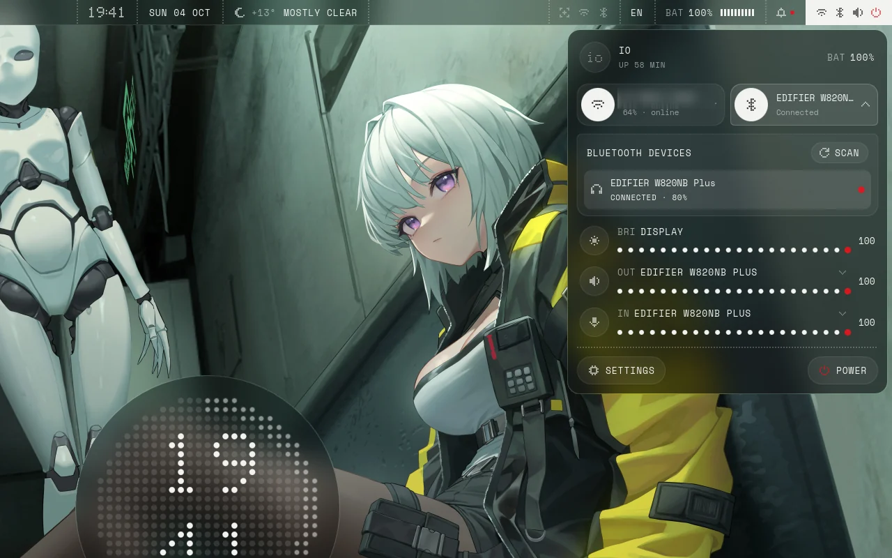
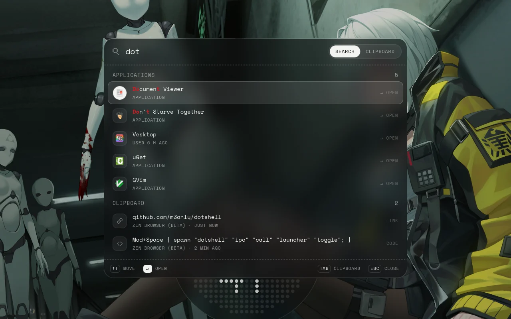
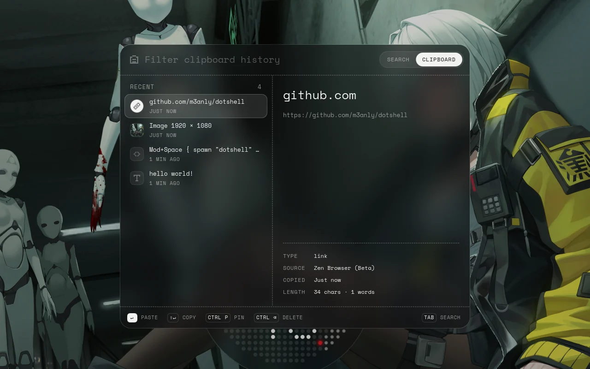
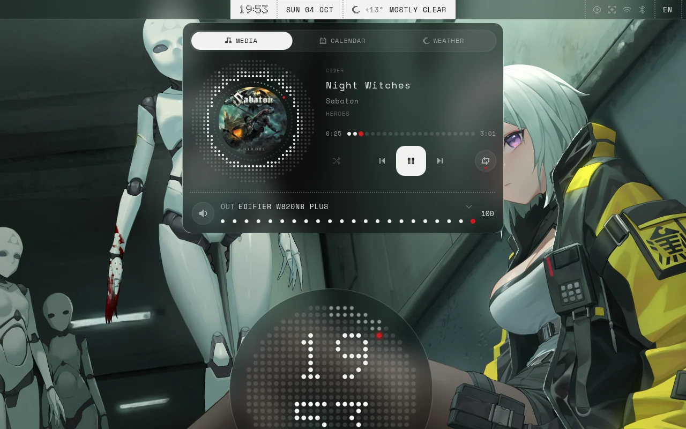
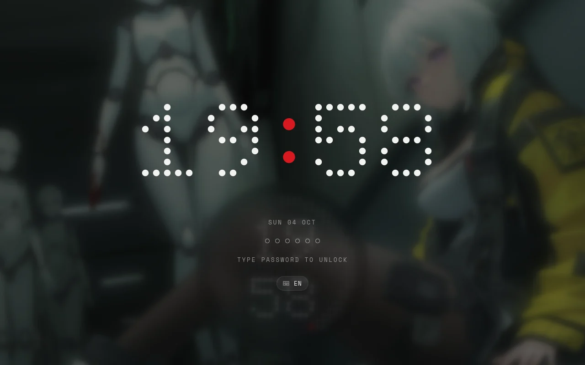
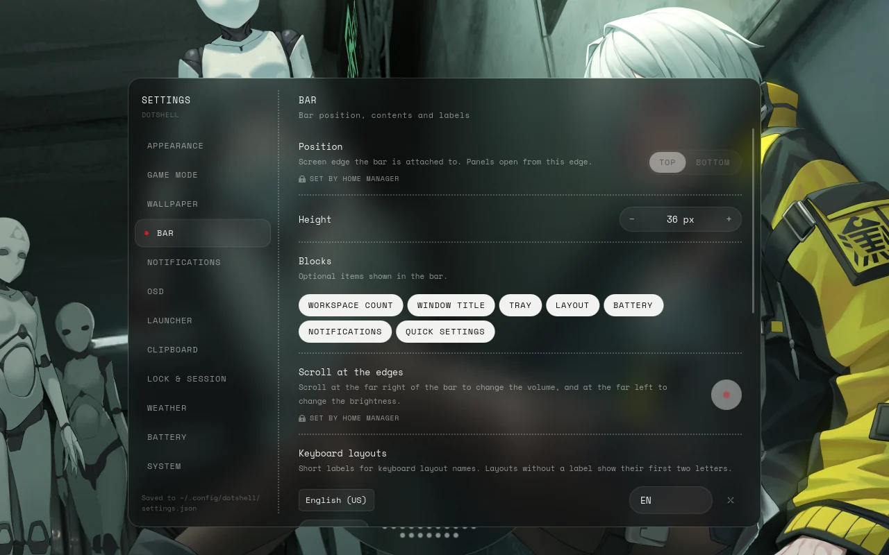

# Dotshell

A desktop shell for [niri](https://github.com/YaLTeR/niri), built on [Quickshell](https://quickshell.org). Inspired by Nothing OS: dot-matrix type, monochrome frosted glass, one red accent and springy motion.



> [!NOTE]
> Dotshell is made for one NixOS laptop and shared as is. It works there; elsewhere, expect rough edges.

## What's inside

- **Bar**: workspaces, the focused window, clock, weather, tray, keyboard layout, battery and quick settings.
- **Launcher** with app search, a calculator and clipboard history (text, images, files, pins).
- **Quick settings**: Wi-Fi, Bluetooth, audio devices, brightness, media and power actions.
- **Notifications** with a notification center and calendar.
- **Dashboard** with media, calendar and weather; a **battery panel** with charge history.
- **Lock screen**, **OSD**, **polkit agent**, **wallpaper** with transitions, a **desktop clock** and a **keybind cheatsheet**.
- **Settings window** for everything above.

| | |
| --- | --- |
|  |  |
|  |  |
|  |  |

## Requirements

- NixOS with niri, using Home Manager.
- PipeWire and NetworkManager.

## Installation

Add the flake to your inputs:

```nix
inputs.dotshell.url = "github:m3anly/dotshell";
```

Enable the NixOS module, which turns on the system services the shell talks to (UPower, power-profiles-daemon, polkit):

```nix
imports = [ inputs.dotshell.nixosModules.default ];
programs.dotshell.enable = true;
```

Enable the Home Manager module, which installs the shell and starts it with your graphical session:

```nix
imports = [ inputs.dotshell.homeModules.default ];
programs.dotshell.enable = true;
```

Then include the window rules and default keybinds in your niri config, before your own binds:

```kdl
include "dotshell/rules.kdl"
include "dotshell/binds.kdl"
```

A bind of your own on the same key replaces the default one.

## Keybinds

| Key | Action |
| --- | --- |
| `Mod+Space` | Launcher |
| `Mod+V` | Clipboard history |
| `Mod+N` | Notification center |
| `Super+X` | Power menu |
| `Mod+Comma`, `Mod+I` | Settings |
| `Mod+/` | Keybind cheatsheet |

Volume, brightness and media keys work out of the box. Everything else is reachable over IPC, for your own binds or scripts:

```sh
dotshell ipc show                       # list every command
dotshell ipc call lock lock
dotshell ipc call dashboard toggle
dotshell ipc call gamemode toggle
dotshell ipc call wallpaper set ~/Pictures/wall.png
```

## Configuration

Most things can be changed live in the settings window. To set them declaratively, use `programs.dotshell.settings`:

```nix
programs.dotshell.settings = {
  wallpaper = "~/Pictures/wallpapers/default.png";
  weather.location = "Paris, France";
  bar.position = "bottom";
  notifications.position = "top-right";
};
```

Options set here are locked in the settings window; the rest stay editable. Every option is documented in [`nix/home-manager.nix`](nix/home-manager.nix).

## Good to know

- Dotshell is the notification daemon, the polkit agent and the screen locker. Stop other notification daemons (mako, dunst, swaync), or Dotshell shows no popups. To keep your own polkit agent or locker, turn off `polkitAgent` or `lockOnLogind`.
- Blur needs a compositor with `ext-background-effect-v1`. Current niri has it.
- Quickshell has to be built from the same nixpkgs as your system, or it cannot load your graphics drivers. The Home Manager module takes care of that by building the shell from your own `pkgs`.

## Development

```sh
nix run .#dev    # run ./shell, reloading on every change
nix run .#lint   # qmllint
```

See [`AGENTS.md`](AGENTS.md) for the repository layout and conventions.

## License

[MIT](LICENSE).
